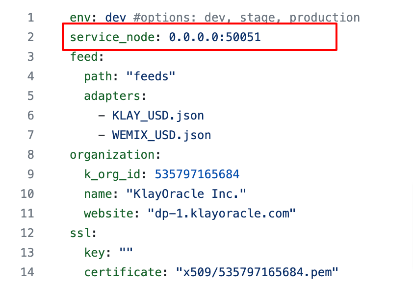

# Installing & running data providers locally

**System requirements**

* 1GB RAM
* At least 128GB of space
* Install the Go

As described in the Fundamentals section, the only way to install & run data providers is by running from source.&#x20;

**Steps**

After cloning the klayoracle-monorepo as described in the fundamentals, follow these steps to  are the&#x20;

From the monorepo, navigate to the `feeds` folder within the `data-provider` package.

```bash
# from monorepo folder
cd data-provider/feeds
```

<figure><figcaption><p><code>feeds</code> folder in monorepo</p></figcaption></figure>

#### 1. Define data feeds

Configure the data feeds (_aka_ adapters) which your data provider will use to fetch and serve data to subscribed consumer contracts. Each data feed includes options for connecting to your data source via HTTP(S), filtering your data and returning a single value using reducers, and sending the value to your oracle contract.

Visit the [Configuring Data Feeds](broken-reference) section of this documentation for step-by-step instructions on defining each of your data feeds.


We've also provided sample data feeds for [KLAY\_USD](https://github.com/KlayOracle/klayoracle-monorepo/blob/development/data-provider/feeds/KLAY\_USD.json) and [WEMIX\_USD](https://github.com/KlayOracle/klayoracle-monorepo/blob/development/data-provider/feeds/WEMIX\_USD.json), which you can edit in order to get started quickly.


#### 2. Generate a unique adapter ID for each feed

Using the `make` command, run the `adapter-id-gen` utility, which generates a unique 32-byte string identifier for each feed defined as a variable within the `ADAPTERS` argument.

```bash
make adapter-id-gen ADAPTERS="ETH_USD.json WEMIX_USD.json"
```

For example, the above command generates separate string identifiers for the `ETH_USD.json` and `WEMIX_USD.json` feeds. Each string is saved within its respective feed as an `adapterId` property.

<figure><figcaption><p>run <code>adapter-id-gen</code></p></figcaption></figure>

<figure><figcaption><p><code>adapterId</code> in feed</p></figcaption></figure>


Running the `adapter-id-gen` utility compresses and uglifies the feed's JSON. Use a [JSON Formatter](https://jsonformatter.curiousconcept.com/) to revert the file's contents to a more readable format.


#### Do a dry run

After defining your data feeds and generating an adapter ID, the next step is to do a dry run.

A dry run verifies that the configured data feeds are valid and will function correctly when the data provider is [connected to a KlayOracle node](broken-reference) in a production environment. It does this by simulating the execution of a node to fetch, aggregate and return data using the properties defined within the data feed.

To do a dry run, run the `adapter-dry-run` command. Pass the list of data feeds you want to verify to the `ADAPTERS` argument in the command. For example:

```bash
make adapter-dry-run ADAPTERS="ETH_USD.json WEMIX_USD.json"
```

A successful dry run fetches data from defined data sources, filters the data using the reducers defined in the adapter, and returns the single value which the oracle contract consumes in a production environment.

<figure><figcaption><p>output of <code>adapter-dry-run</code> command</p></figcaption></figure>


`adapter-id-gen` and `adapter-dry-run` are two of several data provider utilities defined within KlayOracle. Visit the [Utilities](broken-reference) page to learn more.


#### Define configuration and environmental variables

In order to The data provider package contains two files&#x20;

Connecting to node:

* service\_node
* certificate

A sample&#x20;

* retrieve parameters from node to be used within the config.yaml and .env files
* edit the data-providers/config.yaml file
* set up .env file

The env file&#x20;

#### Define other required parameters

#### Deploy oracle contract

ABC

#### Start data provider

ABC
